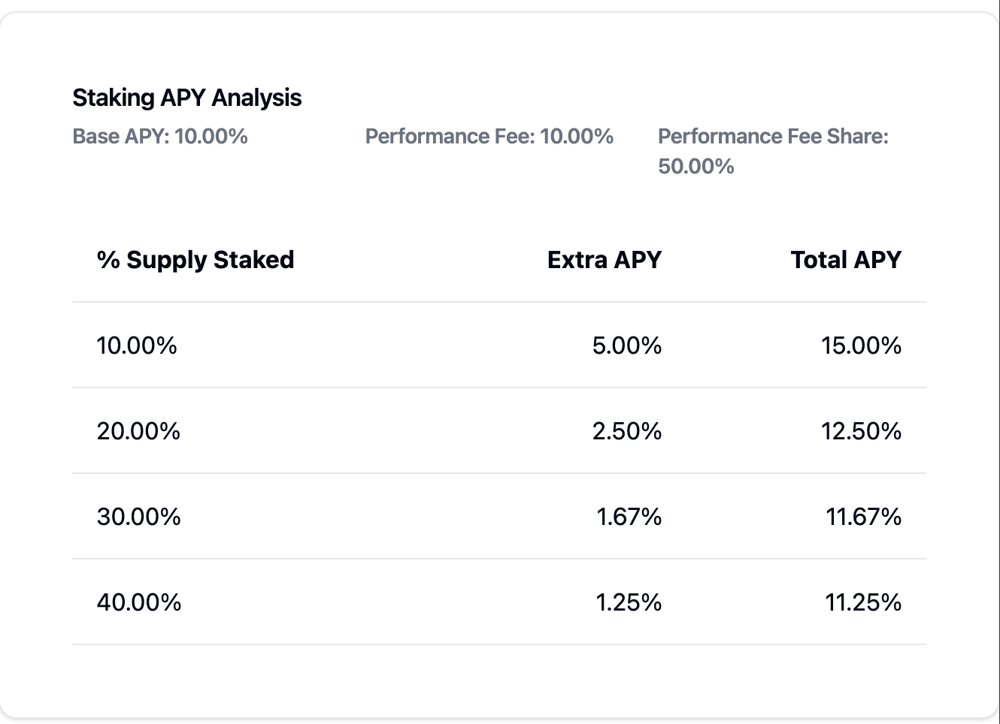

# Greenhouse Product Summary

With Greenhouse’s Revenue Share and Line of Credit, you can maximize your earnings and retain on‐demand liquidity—all while tapping the full potential of CRT.

## Revenue Share

We’re launching a revenue share program for CRT holders as a beta opt‐in feature. By participating, you not only earn the existing yield on CRT, but you also gain a share of the protocol’s performance fees:

- Performance Fee: A 10% performance fee is introduced on the overall yield generated by the protocol.
- Redistribution: A portion of those fees is channeled back to stakers, allowing them to earn even more on top of CRT’s intrinsic yield.

### Staking Mechanics
- Lockup Period: Initially set at 3 days, meaning your CRT must remain staked for at least 72 hours.
- Performance Share: During the beta, stakers receive 50% of the revenue share portion. This percentage may be adjusted in the future based on protocol performance and community feedback.

## Why Stake?
- Boost Your Returns: Beyond the base yield of CRT, stakers capture additional upside from the protocol’s performance fees.
- Short Lockup, Big Potential: A minimal 3‐day lockup balances liquidity needs with enhanced earning opportunities.
- Easy Participation: Choose to opt in at any time; if you decide not to continue, simply wait until the lockup ends, then unstake.

### Example scenarios for stakers

## Line of Credit

Always Be Farming—While Staying Liquid

By converting your stablecoins into CRT, you gain access to the protocol’s stablecoin‐backed treasury yields. At the same time, your staked CRT acts as instant collateral, letting you borrow stablecoins on demand without losing your earning power.

### How It Works

- Deposit: Swap your stablecoins for CRT. Your CRT immediately starts accruing yield from Greenhouse’s treasury strategies.
- Stake: Stake your CRT to lock in additional benefits, from the revenue share program to consistent, compounding rewards.
- Borrow: Need stablecoins for something else? Borrow against your staked CRT at a competitive rate. Because your CRT remains in the protocol, you continue to earn yield the entire time.

### The “Personal Credit Line” Advantage

- Liquid on Demand: Tap into stablecoins whenever you need them, rather than unstaking your CRT.
- No Lost Yield: You keep accumulating rewards even as you borrow.
- Flexible Repayment: Repay whenever is convenient for you. Until then, your collateral remains fully staked and compounding.
- It’s like having a line of credit secured by a constantly compounding balance—perfect for those who want to stay “fully farmed” yet still have instant access to stable liquidity at the click of a button.
