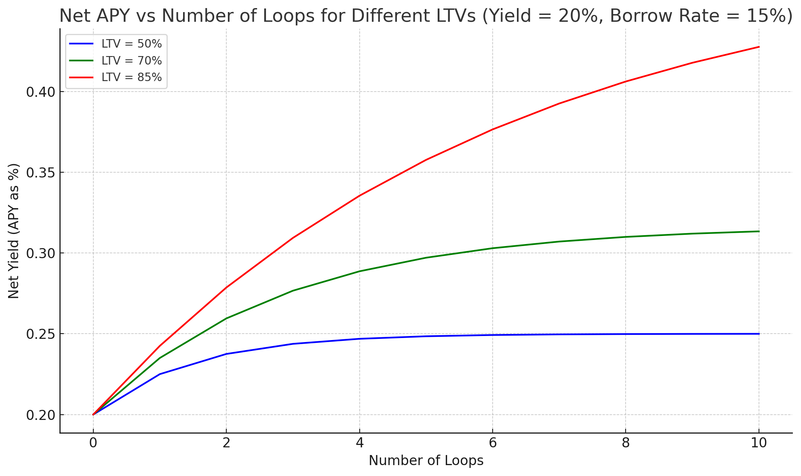

# Greenhouse Summary

Greenhouse provides extra/optional functionality to CRT holders.

## Staking

Staking allows CRT holders to earn extra yield in exchange for locking up their CRT tokens with a predetermined lockup period.

The goal of staking is to align the interests of the protocol and CRT holders.

By locking up their CRT tokens, stakers are committing to the long term success of the protocol. The protocol can then use the funds which represent the staked portion of CRT to earn yield in higher earning but less liquid strategies.

In exchange for locking up their CRT tokens, stakers are earning a portion of the protocol's yield. Currently the protocol takes a performance fee on the yield earned and a redemption fee to burn CRT in exchange for stablecoins.

## Borrowing

Borrowing allows CRT holders to borrow stablecoins against their staked CRT. These stablecoins come from the CRT treasury itself.

In borrow/lend protocols like Kamino, there is a spread between the borrow and lend rates. This allows the protocol to profit by providing the exchange for borrowing and lending stablecoins. Because CRT can directly lend its stables to CRT holders, we CRT can charge a lower borrowing rate than Kamino but a higher rate than the supply or lending rate.

For example, if USDC on Kamino is 5% to supply and 9% to borrow, there's a spread of 4%. CRT can charge 7% borrow which is better than what CRT would get supplying and better for borrowers.

Weekly Adjustable Fixed Rate borrowing will be initially avalable to stakers. Rate will be set transparently and adjusted weekly by protocol maintainers.

In essence, CRT lending directly to holders is better for both parties. If CRT APY is > fixed borrow rate, interesting liquidity and leverage primitives can be created.

### Liquidity

Users can keep their stables earning yield via staked CRT and draw on their balance via borrowing when they need liquidity. When CRT APY is > fixed borrow rate, the loan is self repaying. 

For example, if CRT is earning 12% and the loan is 10%, you have liquid USDC in your wallet and effectively earning 2% yield. This allows holders to earn on their stablecoins, draw liquidity from that yield and never create a taxable event.

### Leverage

Carrot Boost is a feature that allows holders to leverage their staked CRT. When CRT APY is > fixed borrow rate, holders can borrow at a discount and use that borrowed stablecoin to buy more CRT, effectively leveraging their staked CRT position.

