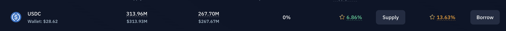

# Internal Rationale for the Revenue Share & Line of Credit Programs

This document provides an internal perspective on the motivations behind introducing a **Revenue Share** program for CRT stakers and offering a **Line of Credit** feature. It explains why these initiatives matter for the protocol’s growth, user engagement, and overall sustainability, and why we, as a protocol, are willing to effectively “pay” for these incentives by sharing fees or offering borrow‐friendly terms.

---

## 1. Revenue Share

### A) Driving Adoption & Loyalty
- **Attracting More CRT Holders**  
  By offering a portion of the performance fee back to CRT stakers, we create a tangible reason for users to hold and stake CRT long‐term. This helps us **bootstrap adoption** and retain users who might otherwise flip or farm in other protocols.  

### B) Aligning Incentives
- **“Skin in the Game”**  
  CRT stakers effectively become co‐owners of the protocol’s success. By sharing performance fees, we align the interest of the protocol with that of its user base.  
- **Reduced Sell Pressure**  
  As stakers earn additional yield via fees, they have less incentive to sell CRT. This can **stabilize token price** and help the protocol manage supply/demand dynamics.
- **Long‐Term Commitment**  
  A short, mandatory lockup (e.g., 3 days) creates enough friction that stakers don’t churn in and out daily. This fosters a **more predictable capital base** and gives the protocol time to optimize yield strategies.  

---

## 2. Line of Credit

### A) Capital Efficiency for Users
- **Attractive Value Proposition**  
  The ability to remain “fully farmed” in CRT while still tapping stablecoin liquidity is key. Instead of forcing users to unstake and lose yield, we let them borrow at a better than market rate. This encourages **more capital inflow** because users feel comfortable locking up stables, knowing they can still access liquidity.

### B) Increase Protocol Stickiness
- **Lock‐In Through Utility**  
  When users see CRT not only as a yield‐bearing asset but also as collateral for a line of credit, they’re more likely to stick around. Their liquidity needs are met without them leaving the ecosystem.  
- **Continuous Engagement**  
  Borrowers must remain engaged to monitor their positions, top up collateral if necessary (in other contexts), and repay their loans eventually. This keeps them active within the protocol.

### C) Increased Yield
- **Protocol Borrow Rate**  
  If the protocol’s treasury is earning 7% from its lending investments via Kamino and Marginfi, and CRT charges 10% on borrowed stables, we retain a profitable margin. Because CRT takes a fee at the token level, we do not need to have such a high spread between lending and borrowing like on typical decentralized lending protocols, thus we can offer a better than market borrow rate which is also better yield than supplying to the lending protocols. For example Kamino JLP is at ~6% to supply USDC and 13% to borrow, this is a spread CRT can take advantage of.

### D) Market Positioning
- **Differentiation from Standard Lending**  
  Many DeFi platforms let you borrow stables by locking up volatile assets (like ETH). A stable‐on‐stable line of credit with near‐zero liquidation risk is unique, **lowering friction** for new users worried about price crashes. 
- **Improved TVL Metrics**  
  By letting users stake CRT and borrow stables without leaving, the protocol keeps more TVL as there won't be as much selling
- **Periodic Adjustable Fixed Rate**
  Some borrowers prefer a simpler, predictable rate structure instead of fluctuating, utilization‐based APRs. By offering a “fixed” rate that adjusts periodically (e.g., weekly), users get short‐term stability without locking the protocol into a single rate forever. This ensures the rate remains competitive for borrowers while allowing the protocol to adapt in step with market conditions, treasury yields, and risk parameters.
